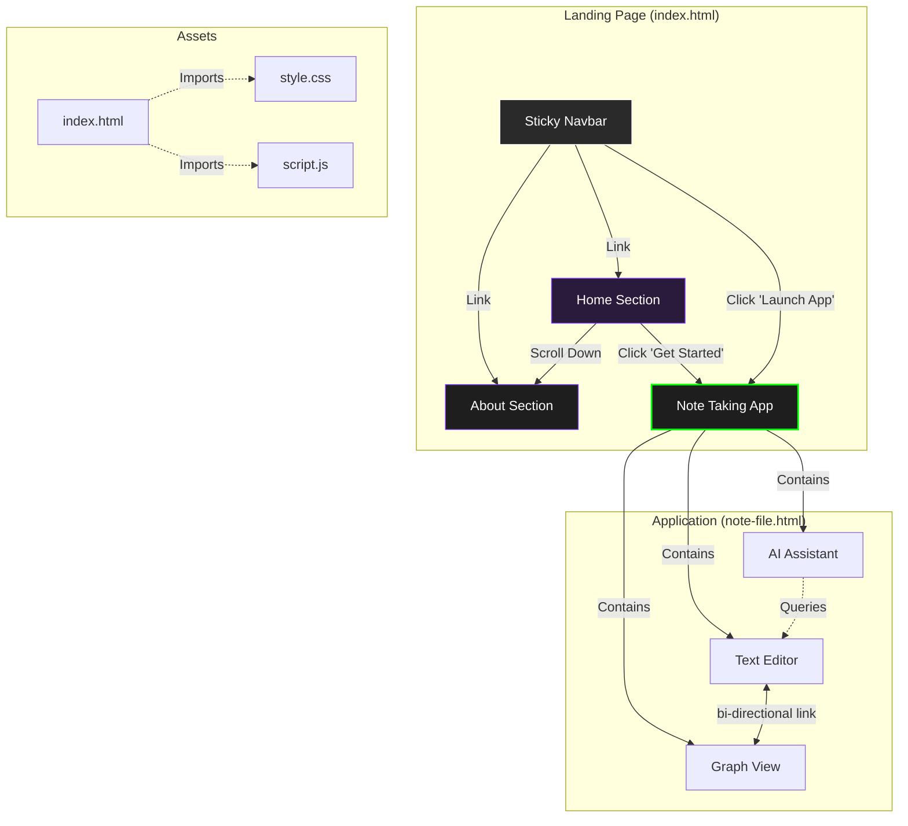

# Brain Mapper

Brain Mapper is a personal knowledge base and note-taking application designed to help you capture, organize, and visualize your thoughts.

## Project Architecture & Wireframe

The following diagram illustrates the project structure and the flow between the Landing Page and the Application.

> **Note**: Please update this README and the diagram below whenever there are architectural changes to the project.

## Component Breakdown

1.  **`index.html`**: The marketing landing page.
    *   **Features**: Sticky Navbar, Hero Section, Floating 3D Cards, About Section.
    *   **Role**: Introduces the product and links to the core app.
2.  **`note-file.html`**: The core application.
    *   **Features**:
        *   **Text Editor**: Wiki-style linking using `[[Note Title]]`.
        *   **Graph View**: Visualizes connections between notes.
        *   **AI Assistant**: A chatbot that answers your questions to help you think.
    *   **Architecture**: Designed as a single-file portable app.
3.  **`script.js`**:
    *   **Role**: Handles interaction and smooth scrolling for the Landing Page.
4.  **`style.css`**:
    *   **Role**: Provides the global styling, typography (San Francisco), and theme for the Landing Page.

## Getting Started

1.  **Clone or Download** the repository.
2.  **Open `index.html`** in your web browser to view the Landing Page.
3.  Click **"Launch App"** or **"Get Started"** to open the Note Taking App (`note-file.html`) in a new tab.

## Usage Guide

*   **Creating Notes**: Click "+ New Note" in the sidebar.
*   **Linking**: Type `[[` followed by the title of another note to create a link.
*   **Graph View**: Click the "Graph View" toggle to see your note network.
*   **AI Chat**: Click the floating robot icon to ask questions. (Note: The AI currently ignores note content to focus on unbiased questioning).
